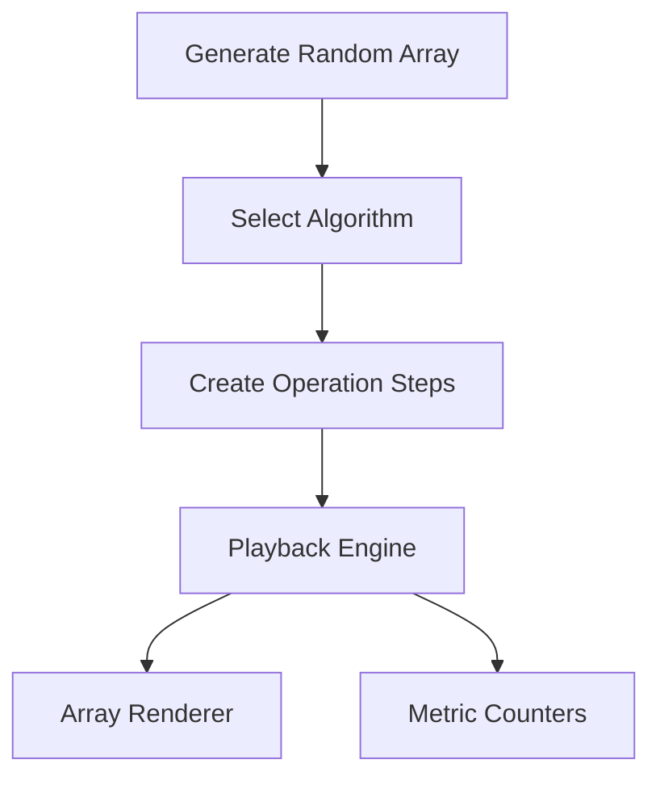

# Algorithm Visualizer

Browser sorting visualizer for studying algorithm behavior step-by-step.

## Features

- Sorting algorithms: Bubble, Insertion, Merge, Shell, Heap, Quick, Radix.
- Tight control surface: apply array, randomize, compare all, start/pause/step/back/reset.
- Auto-pick best-fit control uses workload shape to recommend the most defensible first sorter before benchmarking.
- Shortcut support now includes `P` for best-fit auto-pick before a compare-all pass.
- Keyboard shortcut `G` now runs the full preset gauntlet benchmark without reaching for the mouse.
- Step scrubber for dragging directly to any replay point after generating operations.
- Adjustable array size and animation speed.
- Core diagnostics: sortedness, duplicate rate, value spread, inversions, algorithm profile, and benchmark verdict.
- One-click comparison snapshot across all implemented sorting algorithms.
- Comparison snapshot can now be re-ranked by total work, comparisons, writes, or swaps without rerunning the workload.
- Operation counters:
  - Comparisons
  - Swaps
  - Writes
- Responsive bar visualization with color-coded state legend.

## Technical Design

- `index.html`: semantic controls and metrics layout.
- `style.css`: responsive visual system and high-contrast states.
- `script.js`: operation-generation approach where each algorithm emits replayable steps.



## Why This Design

Instead of sorting directly in the DOM, each algorithm produces a list of deterministic operations (`compare`, `swap`, `overwrite`). That makes the UI easier to test, pause/resume, and step through.

## Demo Flow

1. Load a patterned workload.
2. Use `Best Fit` before a full compare-all pass.
3. Export the comparison CSV when the theory-vs-runtime tradeoff becomes visible.

## Honest Label

- Project type: browser sorting visualizer
- Stack truth: HTML, CSS, JavaScript

## Demo workflow

1. Generate or import an array.
2. Use `Auto Pick` when you want the app to choose the most defensible first algorithm for that workload.
3. Run `Compare All` to benchmark the same input across the full implemented set.
4. Export the comparison CSV or copy the benchmark brief when you need a reusable walkthrough artifact.

## Local Run

```bash
python -m http.server 8000
```

Open `http://localhost:8000`.

## Reproducible Workloads

- The app preserves its active workload in the URL, so shared links can reopen the same sorter, sliders, and array state.
- The UI now exposes the whole workload utility shelf directly: share link, save workload, import/export, compare CSV, compare tape, and gauntlet runs.
- Use the built-in share/export controls when you want a benchmark discussion to stay tied to one exact input shape instead of a fresh random run.

## Portfolio Demo Path

1. Load the `Reversed` preset.
2. Run `Compare All` to create a benchmark verdict.
3. Scrub through Quick Sort or Merge Sort to show replayable operations.
4. Contrast with Bubble Sort to make performance tradeoffs obvious.

## GitHub Pages Compatibility

- Pure static assets.
- No build pipeline required.
- Deploy from repository root.

## Portfolio Positioning

- Honest label: browser-based sorting visualizer, not native systems software.
- Strongest portfolio use: replayable algorithm explanation and workload comparison.
- Current quality bar: keep the control surface teachable and avoid turning the page into a diagnostics wall.

## Future Improvements

- Add side-by-side visual diffing between two selected sorters on the same workload.
- Add comparison history across multiple imported workloads.

## Sanity Benchmark Script

For consistent portfolio claims, use this benchmark script before sharing results:

1. Run `Nearly Sorted` at 80 bars and capture `Compare All`.
2. Run `Few Unique` at 80 bars and capture `Compare All`.
3. Run `Reversed` at 120 bars and capture `Compare All`.
4. Report the best/worst algorithm by workload type rather than one global winner.

## Quick Verification Command

Run this syntax check before sharing updates:
- node --check script.js

