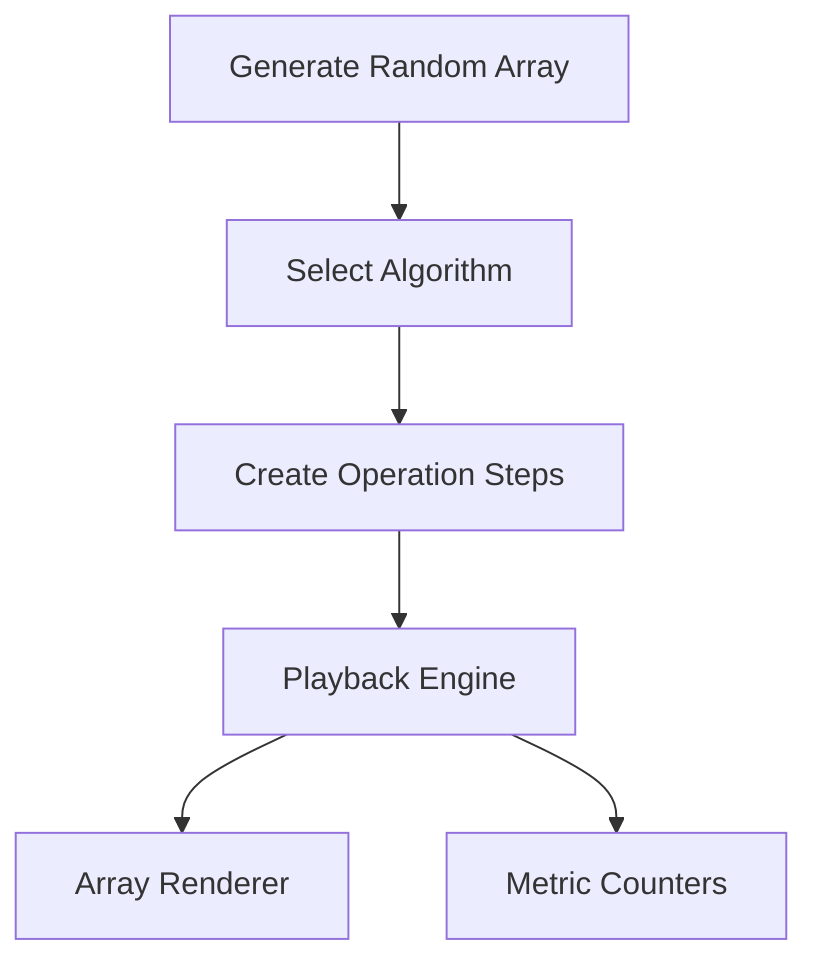

# Algorithm Visualizer Lab

Professional sorting visualizer for studying algorithm behavior step-by-step.

## Features

- Sorting algorithms: Bubble, Insertion, Merge, Heap, Quick.
- Playback controls: start, pause, step, reset, randomize.
- Adjustable array size and animation speed.
- Operation counters:
  - Comparisons
  - Swaps
  - Writes
- Responsive bar visualization with color-coded state legend.

## Technical Design

- `index.html`: semantic controls and metrics layout.
- `style.css`: responsive visual system and high-contrast states.
- `script.js`: operation-generation approach where each algorithm emits replayable steps.



## Why This Design

Instead of sorting directly in the DOM, each algorithm produces a list of deterministic operations (`compare`, `swap`, `overwrite`). That makes the UI easier to test, pause/resume, and step through.

## Local Run

```bash
python -m http.server 8000
```

Open `http://localhost:8000`.

## GitHub Pages Compatibility

- Pure static assets.
- No build pipeline required.
- Deploy from repository root.

## Future Improvements

- Add radix sort and shell sort.
- Add operation timeline scrubber.
- Add import/export for custom arrays.
